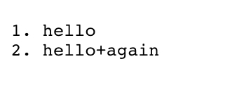

# Lab Report 2

## Part 1

The screenshots above show the code used. 

This was the result of using add-message

This is the way add-message was used. The same process was used to get hello initially.

**Which methods in your code are called?**
handleRequest is called.

**What are the relevant arguments to those methods, and the values of any relevant fields of the class?**
Relevant arguments are the url and what's added on the end of the url once the server is started. 
_num_ is a relevant field as it helps creates a numbered list and is initially set to 0 and icnreases by one everytime someone adds a mesage.
_thewords_ is also initally set to 0 and contains all the text displayed on the page.

**How do the values of any relevant fields of the class change from this specific request? If no values got changed, explain why.**
_num_ increases by one everytime an add-message request is submitted to create a numbered list
_thewords_ just becomes a longer string every time a message is added.

## Part 2

Above a screenshot of the public and private keys, created to log into the remote computer with.out a password, is displayed. The command ls was used.

![Image](withoutpasswword.png

This screenshot shows proof of the keys working and logging in without a password 

## Part 3
**In a couple of sentences, describe something you learned from lab in week 2 or 3 that you didn’t know before.**
I learned how to remotely connect to the computer in week 2 by using our own personal code. Now, I am able to use this remote computer from anywhere, whcih i thought was extremely neat and impressive. You simply jsut have to use ssh and then the specific emaila nd then enter your password. Now, I don't even need the password due to the keys I created.
